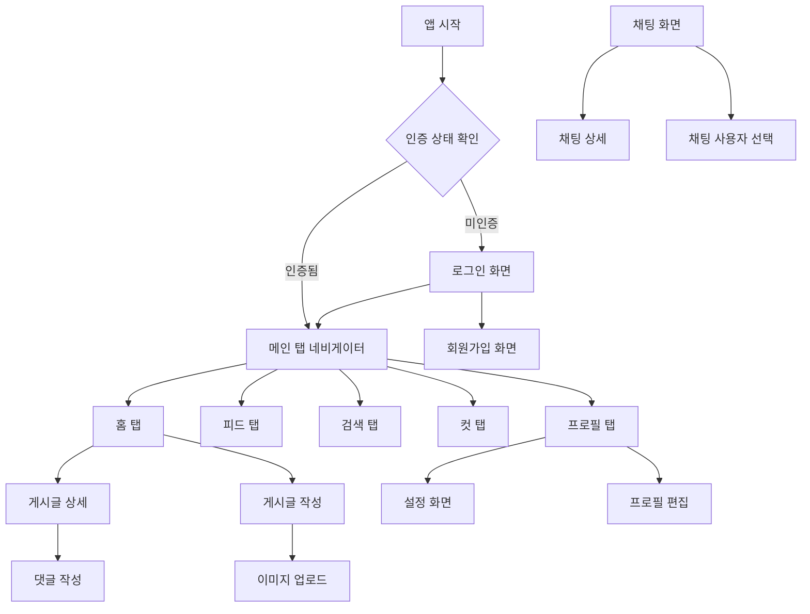

# SA Native - 소셜 커뮤니티 모바일 앱

<div align="center">


**모던한 React Native로 구축된 실시간 소셜 커뮤니티 플랫폼**

[📱 기능 소개](#-주요-기능) • [🏗️ 아키텍처](#️-프로젝트-아키텍처) • [🚀 시작하기](#-시작하기) • [📸 스크린샷](#-스크린샷)

</div>

---

## 📖 프로젝트 개요

**SA Native**는 React Native와 Expo를 기반으로 구축된 현대적인 소셜 커뮤니티 모바일 애플리케이션입니다. 실시간 채팅, 게시글 공유, 사용자 상호작용 등 소셜 미디어의 핵심 기능을 제공하며, TypeScript와 최신 기술 스택을 활용하여 안정적이고 확장 가능한 구조로 설계되었습니다.

### ✨ 핵심 특징

- 🔐 **보안 인증 시스템** - JWT 기반 사용자 인증 및 권한 관리
- 💬 **실시간 채팅** - Socket.io를 활용한 1:1 및 그룹 채팅
- 📝 **콘텐츠 관리** - 카테고리별 게시글 작성, 조회, 댓글 시스템
- 🖼️ **멀티미디어 지원** - 이미지 업로드 및 관리
- 👥 **소셜 기능** - 사용자 프로필, 팔로우 시스템
- 🎨 **모던 UI/UX** - 직관적이고 아름다운 사용자 인터페이스
- 📱 **크로스 플랫폼** - iOS와 Android 모두 지원

---

## 🏗️ 프로젝트 아키텍처

### 기술 스택

| 분류 | 기술 | 버전 | 설명 |
|------|------|------|------|
| **프레임워크** | React Native | 0.79.5 | 크로스 플랫폼 모바일 앱 개발 |
| **개발 도구** | Expo | 53.0.20 | React Native 개발 플랫폼 |
| **언어** | TypeScript | 5.8.3 | 정적 타입 지원 |
| **상태 관리** | Zustand | 5.0.7 | 경량 상태 관리 라이브러리 |
| **네비게이션** | React Navigation | 7.x | 화면 간 이동 및 라우팅 |
| **실시간 통신** | Socket.io | 4.8.1 | 실시간 양방향 통신 |
| **로컬 저장소** | AsyncStorage | 2.1.2 | 로컬 데이터 저장 |
| **이미지 처리** | Expo Image Picker | 16.1.4 | 이미지 선택 및 업로드 |
| **UI 컴포넌트** | React Native SVG | 15.11.2 | 벡터 그래픽 지원 |

### 프로젝트 구조

```
src/
├── components/          # 재사용 가능한 UI 컴포넌트
│   ├── ChatActionIcons.tsx      # 채팅 액션 아이콘
│   ├── ChatHeader.tsx           # 채팅 헤더
│   ├── PostCard.tsx             # 게시글 카드
│   ├── ProfileHeader.tsx        # 프로필 헤더
│   └── ...                     # 기타 컴포넌트들
├── screens/             # 앱 화면 컴포넌트
│   ├── HomeScreen.tsx           # 메인 홈 화면
│   ├── ChatScreen.tsx           # 채팅 목록 화면
│   ├── ProfileScreen.tsx        # 사용자 프로필 화면
│   ├── CreatePostScreen.tsx     # 게시글 작성 화면
│   └── ...                     # 기타 화면들
├── services/            # 비즈니스 로직 및 API 통신
│   ├── apiClient.ts             # HTTP 클라이언트
│   ├── authService.ts           # 인증 관련 서비스
│   ├── chatService.ts           # 채팅 관련 서비스
│   ├── postService.ts           # 게시글 관련 서비스
│   └── ...                     # 기타 서비스들
├── stores/              # 전역 상태 관리
│   ├── authStore.ts             # 인증 상태 관리
│   └── chatStore.ts             # 채팅 상태 관리
├── navigation/          # 네비게이션 설정
│   ├── AuthNavigator.tsx        # 인증 네비게이션
│   └── TabNavigator.tsx         # 탭 네비게이션
├── types/               # TypeScript 타입 정의
├── constants/           # 상수 및 테마 설정
├── utils/               # 유틸리티 함수
└── data/                # 목 데이터 및 정적 데이터
```

---

## 🚀 주요 기능

### 1. 🏠 홈 화면 (HomeScreen)
**위치**: `src/screens/HomeScreen.tsx`

**주요 기능**:
- 카테고리별 게시글 피드 표시
- 실시간 게시글 업데이트
- 페이지네이션을 통한 효율적인 콘텐츠 로딩
- 카테고리 및 서브카테고리 필터링
- 새로고침 및 무한 스크롤

**기술적 특징**:
- React Navigation을 통한 화면 전환
- Zustand를 활용한 상태 관리
- API 클라이언트를 통한 데이터 페칭
- 컴포넌트 기반 모듈화

### 2. 💬 채팅 시스템
**위치**: `src/screens/ChatScreen.tsx`, `src/screens/ChatDetailScreen.tsx`

**주요 기능**:
- 1:1 개인 채팅
- 그룹 채팅방 생성 및 관리
- 실시간 메시지 송수신
- 채팅방 정보 수정 및 관리
- 메시지 히스토리 및 페이지네이션

**기술적 특징**:
- Socket.io를 활용한 실시간 통신
- WebSocket 연결 상태 관리
- 채팅방별 메시지 캐싱
- 사용자별 온라인 상태 표시

### 3. 📝 게시글 관리
**위치**: `src/screens/CreatePostScreen.tsx`, `src/screens/PostDetailScreen.tsx`

**주요 기능**:
- 멀티미디어 게시글 작성
- 카테고리별 콘텐츠 분류
- 댓글 및 좋아요 시스템
- 이미지 업로드 및 관리
- 게시글 검색 및 필터링

**기술적 특징**:
- FormData를 활용한 이미지 업로드
- 카테고리 계층 구조 관리
- 댓글 시스템의 중첩 구조
- API 응답 표준화

### 4. 👤 사용자 프로필
**위치**: `src/screens/ProfileScreen.tsx`

**주요 기능**:
- 사용자 정보 표시 및 수정
- 게시글 히스토리 관리
- 팔로우/언팔로우 시스템
- 프로필 이미지 관리
- 사용자 활동 통계

**기술적 특징**:
- Zustand를 활용한 사용자 상태 관리
- 이미지 피커를 통한 프로필 사진 변경
- 팔로우 관계의 실시간 업데이트

### 5. 🔍 검색 및 탐색
**위치**: `src/screens/SearchScreen.tsx`

**주요 기능**:
- 사용자 및 게시글 검색
- 실시간 검색 결과 표시
- 검색 히스토리 관리
- 필터링 및 정렬 옵션

---

## 🔗 화면 연결 구조

### 네비게이션 플로우



### 화면 간 데이터 전달

| 화면 전환 | 데이터 전달 방식 | 설명 |
|-----------|------------------|------|
| 홈 → 게시글 상세 | `navigation.navigate('PostDetail', { postId }` | 게시글 ID를 통한 상세 정보 조회 |
| 프로필 → 설정 | `navigation.navigate('Settings')` | 사용자 정보를 통한 설정 화면 표시 |
| 채팅 → 채팅 상세 | `navigation.navigate('ChatDetail', { chatRoom }` | 채팅방 정보를 통한 실시간 채팅 |
| 게시글 작성 → 홈 | `navigation.goBack()` | 작성 완료 후 이전 화면으로 복귀 |

---

## 📸 스크린샷

### 메인 화면들

#### 🏠 홈 화면
> **설명**: 메인 피드와 카테고리 선택이 가능한 홈 화면
> 
> **스크린샷 추가 예정** 📱
> 
> **주요 UI 요소**:
> - 상단 헤더 (알림, 프로필)
> - 카테고리 선택기
> - 게시글 카드 목록
> - 페이지네이션

#### 💬 채팅 화면
> **설명**: 실시간 채팅방 목록과 관리 기능
> 
> **스크린샷 추가 예정** 💬
> 
> **주요 UI 요소**:
> - 채팅방 목록
> - 탭 전환 (개인/그룹)
> - 액션 시트 (채팅방 관리)
> - 실시간 상태 표시

#### 📝 게시글 작성
> **설명**: 멀티미디어 게시글 작성 화면
> 
> **스크린샷 추가 예정** ✍️
> 
> **주요 UI 요소**:
> - 텍스트 입력 영역
> - 이미지 업로드 영역
> - 카테고리 선택
> - 게시 버튼

#### 👤 프로필 화면
> **설명**: 사용자 프로필 및 활동 관리
> 
> **스크린샷 추가 예정** 👤
> 
> **주요 UI 요소**:
> - 프로필 헤더
> - 활동 탭 (게시글, 좋아요)
> - 설정 버튼
> - 팔로우 정보

#### 🔍 검색 화면
> **설명**: 사용자 및 콘텐츠 검색 기능
> 
> **스크린샷 추가 예정** 🔍
> 
> **주요 UI 요소**:
> - 검색 입력창
> - 검색 결과 목록
> - 필터 옵션
> - 최근 검색어

---

## 🛠️ 시작하기

### 필수 요구사항

- **Node.js**: 18.0.0 이상
- **npm**: 9.0.0 이상
- **Expo CLI**: 최신 버전
- **Android Studio** (Android 개발용)
- **Xcode** (iOS 개발용, macOS만)

### 설치 및 실행

```bash
# 1. 저장소 클론
git clone [repository-url]
cd sa-native

# 2. 의존성 설치
npm install

# 3. 개발 서버 시작
npm start

# 4. 플랫폼별 실행
npm run android    # Android 에뮬레이터
npm run ios        # iOS 시뮬레이터
npm run web        # 웹 브라우저
```

### 환경 설정

```bash
# .env 파일 생성 (필요시)
cp .env.example .env

# 환경 변수 설정
EXPO_PUBLIC_API_URL=your_api_url
EXPO_PUBLIC_SOCKET_URL=your_socket_url
```

---

## 🔧 개발 가이드

### 코드 스타일

- **TypeScript**: 엄격한 타입 체크 활성화
- **ESLint**: 코드 품질 및 일관성 유지
- **Prettier**: 코드 포맷팅 자동화
- **컴포넌트**: 함수형 컴포넌트 및 React Hooks 사용

### 아키텍처 패턴

- **서비스 레이어**: 비즈니스 로직 분리
- **상태 관리**: Zustand를 활용한 전역 상태 관리
- **API 통신**: 중앙화된 API 클라이언트
- **타입 안전성**: TypeScript를 통한 런타임 에러 방지

### 테스트

```bash
# 단위 테스트 실행
npm test

# E2E 테스트 실행
npm run test:e2e

# 테스트 커버리지 확인
npm run test:coverage
```

---

## 🚧 향후 개발 계획

### 📅 단기 목표 (1-2개월)

- [ ] **푸시 알림 시스템** 구현
- [ ] **다크 모드** 테마 지원
- [ ] **오프라인 모드** 지원
- [ ] **성능 최적화** 및 메모리 누수 방지
- [ ] **접근성** 개선 (스크린 리더 지원)

### 🎯 중기 목표 (3-6개월)

- [ ] **실시간 알림** 시스템 강화
- [ ] **파일 공유** 기능 확장
- [ ] **사용자 차단** 및 신고 시스템
- [ ] **콘텐츠 모더레이션** 도구
- [ ] **분석 대시보드** 구현

### 🌟 장기 목표 (6개월 이상)

- [ ] **AI 기반 콘텐츠 추천** 시스템
- [ ] **라이브 스트리밍** 기능
- [ ] **크로스 플랫폼** 웹 앱 지원
- [ ] **마이크로서비스** 아키텍처로 확장
- [ ] **국제화** (i18n) 지원

### 🔮 기술적 개선사항

- [ ] **React Native 0.80+** 마이그레이션
- [ ] **Expo SDK 54+** 업그레이드
- [ ] **새로운 네비게이션** 라이브러리 도입 검토
- [ ] **성능 모니터링** 도구 통합
- [ ] **자동화된 배포** 파이프라인 구축

---

## 🤝 기여하기

### 개발 환경 설정

```bash
# 1. 포크 및 클론
git clone https://github.com/your-username/sa-native.git
cd sa-native

# 2. 개발 브랜치 생성
git checkout -b feature/your-feature-name

# 3. 변경사항 커밋
git add .
git commit -m "feat: add your feature description"

# 4. Pull Request 생성
git push origin feature/your-feature-name
```

### 코딩 컨벤션

- **커밋 메시지**: Conventional Commits 형식 준수
- **브랜치 명명**: `feature/`, `bugfix/`, `hotfix/` 접두사 사용
- **코드 리뷰**: 모든 변경사항에 대한 리뷰 필수
- **테스트**: 새로운 기능에 대한 테스트 코드 작성

---

## 📄 라이선스

이 프로젝트는 [MIT 라이선스](LICENSE) 하에 배포됩니다.

---

## 📞 연락처

- **프로젝트 관리자**: [이름]
- **이메일**: [email@example.com]
- **GitHub**: [@username]
- **프로젝트 이슈**: [GitHub Issues](https://github.com/username/sa-native/issues)

---

<div align="center">

**SA Native** - 소셜 커뮤니티의 새로운 경험을 만들어갑니다 🚀

[⬆️ 맨 위로](#sa-native---소셜-커뮤니티-모바일-앱)

</div>
