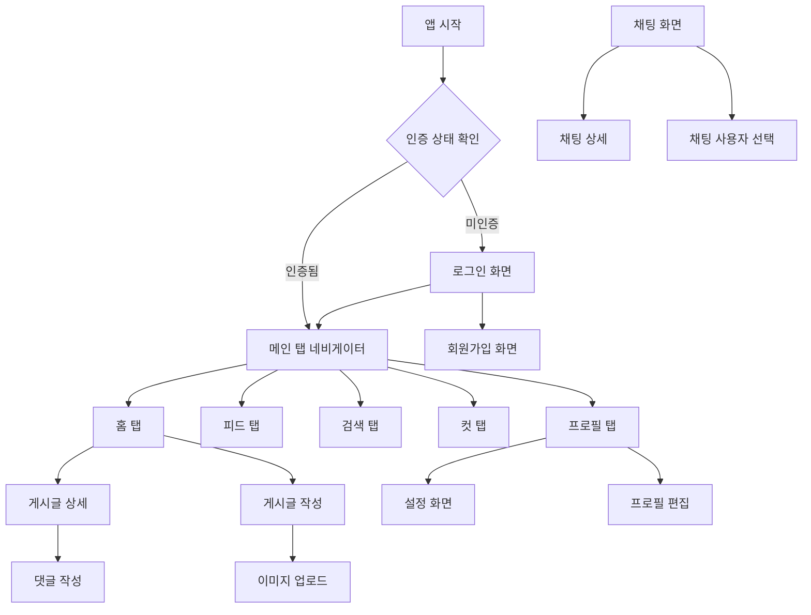

# SA Native - 광고 지원 소셜 커뮤니티 & 영상 콘텐츠 플랫폼

<div align="center">


**광고 수익화와 영상 콘텐츠를 지원하는 차세대 소셜 커뮤니티 플랫폼**

[📱 기능 소개](#-주요-기능) • [🏗️ 아키텍처](#️-프로젝트-아키텍처) • [🚀 시작하기](#-시작하기) • [📸 스크린샷](#-스크린샷) • [💰 광고 시스템](#-광고-시스템)

</div>

---

## 📖 프로젝트 개요

**SA Native**는 React Native와 Expo를 기반으로 구축된 현대적인 소셜 커뮤니티 모바일 애플리케이션으로, 전통적인 소셜 기능에 **광고 수익화 시스템**과 **세로형 영상 콘텐츠(CUTS)** 기능을 결합한 하이브리드 플랫폼입니다. 

실시간 채팅, 게시글 공유, 영상 콘텐츠, 사용자 상호작용 등 소셜 미디어의 핵심 기능을 제공하며, **AdMob 광고 시스템**을 통해 지속 가능한 수익 모델을 구현했습니다. TypeScript와 최신 기술 스택을 활용하여 안정적이고 확장 가능한 구조로 설계되었습니다.

### ✨ 핵심 특징

- 🔐 **보안 인증 시스템** - JWT 기반 사용자 인증 및 권한 관리
- 💰 **광고 수익화 시스템** - AdMob 네이티브 광고 및 배너 광고 지원
- 📹 **영상 콘텐츠 플랫폼** - 세로형 영상(CUTS) 업로드 및 재생 시스템
- 💬 **실시간 채팅** - Socket.io를 활용한 1:1 및 그룹 채팅
- 📝 **콘텐츠 관리** - 카테고리별 게시글 작성, 조회, 댓글 시스템
- 🖼️ **멀티미디어 지원** - 이미지/비디오 업로드 및 관리
- 👥 **소셜 기능** - 사용자 프로필, 팔로우 시스템, 저장된 항목
- 🎨 **모던 UI/UX** - 직관적이고 아름다운 사용자 인터페이스
- 📱 **크로스 플랫폼** - iOS와 Android 모두 지원
- 📊 **고급 알림 시스템** - 실시간 알림 및 알림 설정 관리

---

## 🗺️ 화면 네비게이션 구조

### 앱 시작부터 메인 화면까지

```
앱 실행 → 인증 확인
    ├── 미인증: 로그인 화면 → 회원가입 화면 (선택)
    └── 인증됨: 메인 탭 네비게이터 (홈/피드/검색/컷/프로필)
```

### 메인 탭 네비게이션 (하단 탭)

1. **🏠 홈 탭 (HomeTab)**
   - 카테고리별 게시글 피드
   - 게시글 작성 버튼 (우측 상단)
   - 게시글 상세 → 댓글 작성 → 사용자 프로필

2. **📱 피드 탭 (FeedTab)**
   - 팔로우한 사용자의 콘텐츠 피드
   - 스토리 섹션
   - 피드 상세 → 댓글/좋아요

3. **🔍 검색 탭 (SearchTab)**
   - 사람/게시물/피드 검색
   - 실시간 검색 결과
   - 검색 결과 → 프로필/게시글 상세/피드 상세

4. **✂️ 컷 탭 (CutTab)**
   - 일상 컷 관리
   - 컷 추가/수정/삭제

5. **👤 프로필 탭 (ProfileTab)**
   - 본인 프로필: 설정/프로필 편집
   - 타인 프로필: 팔로우/채팅/차단

### 주요 화면 전환 흐름

#### 게시글 관련
```
홈 화면 → 게시글 작성 → 카테고리 선택 → 콘텐츠 입력 (텍스트/이미지/비디오) → 게시
홈 화면 → 게시글 상세 → 댓글 작성 → 사용자 프로필 → 팔로우/언팔로우
```

#### 채팅 관련
```
프로필 화면 → 채팅 버튼 → 채팅 사용자 선택 → 채팅방 생성 → 채팅 상세
채팅 목록 → 채팅방 선택 → 채팅 상세 (실시간 메시지 송수신)
```

#### 사용자 상호작용
```
검색 화면 → 사람 검색 → 프로필 방문 → 팔로우 요청 → 팔로우 목록
프로필 화면 → 설정 → 프로필 편집 → 닉네임/바이오/프로필 이미지 변경
```

#### 콘텐츠 관리
```
피드 탭 → 피드 상세 → 좋아요/댓글 → 공유
컷 탭 → 컷 추가 → 캔버스 편집 → 일상 컷 저장
```

---

## 🏗️ 프로젝트 아키텍처

### 기술 스택

| 분류 | 기술 | 버전 | 설명 |
|------|------|------|------|
| **프레임워크** | React Native | 0.79.5 | 크로스 플랫폼 모바일 앱 개발 |
| **개발 도구** | Expo | 53.0.20 | React Native 개발 플랫폼 |
| **언어** | TypeScript | 5.8.3 | 정적 타입 지원 |
| **상태 관리** | Zustand | 5.0.7 | 경량 상태 관리 라이브러리 |
| **네비게이션** | React Navigation | 7.x | 화면 간 이동 및 라우팅 |
| **실시간 통신** | Socket.io | 4.8.1 | 실시간 양방향 통신 |
| **로컬 저장소** | AsyncStorage | 2.1.2 | 로컬 데이터 저장 |
| **이미지 처리** | Expo Image Picker | 16.1.4 | 이미지 선택 및 업로드 |
| **UI 컴포넌트** | React Native SVG | 15.11.2 | 벡터 그래픽 지원 |
| **광고 시스템** | react-native-google-mobile-ads | 13.2.0 | AdMob 광고 통합 |
| **영상 재생** | expo-video | 0.1.10 | 세로형 영상 재생 |
| **애니메이션** | react-native-reanimated | 3.12.0 | 고성능 애니메이션 |
| **멀티미디어** | expo-media-library | 16.8.1 | 미디어 파일 관리 |

### 프로젝트 구조

```
src/
├── components/          # 재사용 가능한 UI 컴포넌트
│   ├── ChatActionIcons.tsx      # 채팅 액션 아이콘
│   ├── ChatHeader.tsx           # 채팅 헤더
│   ├── PostCard.tsx             # 게시글 카드
│   ├── ProfileHeader.tsx        # 프로필 헤더
│   ├── NativeBannerAd.tsx       # 네이티브 배너 광고
│   ├── FeedAdCard.tsx           # 피드 광고 카드
│   ├── ShortItemComponent.tsx   # 세로형 영상 컴포넌트
│   ├── ShortItemAdComponent.tsx # 영상 광고 컴포넌트
│   └── ...                     # 기타 컴포넌트들
├── screens/             # 앱 화면 컴포넌트
│   ├── HomeScreen.tsx           # 메인 홈 화면
│   ├── ChatScreen.tsx           # 채팅 목록 화면
│   ├── ProfileScreen.tsx        # 사용자 프로필 화면
│   ├── CreatePostScreen.tsx     # 게시글 작성 화면
│   ├── CutScreen.tsx            # 영상 컷 화면
│   ├── CutDetailScreen.tsx      # 영상 상세 화면
│   ├── NotificationScreen.tsx   # 알림 화면
│   ├── SavedItemsScreen.tsx     # 저장된 항목 화면
│   ├── SupportListScreen.tsx    # 고객센터 화면
│   └── ...                     # 기타 화면들
├── services/            # 비즈니스 로직 및 API 통신
│   ├── apiClient.ts             # HTTP 클라이언트
│   ├── authService.ts           # 인증 관련 서비스
│   ├── chatService.ts           # 채팅 관련 서비스
│   ├── postService.ts           # 게시글 관련 서비스
│   ├── cutService.ts            # 영상 컷 서비스
│   ├── feedService.ts           # 피드 서비스
│   ├── notificationService.ts   # 알림 서비스
│   ├── storyService.ts          # 스토리 서비스
│   ├── supportService.ts        # 고객센터 서비스
│   └── ...                     # 기타 서비스들
├── stores/              # 전역 상태 관리
│   ├── authStore.ts             # 인증 상태 관리
│   ├── chatStore.ts             # 채팅 상태 관리
│   ├── cutStore.ts              # 영상 컷 상태 관리
│   ├── feedStore.ts             # 피드 상태 관리
│   ├── notificationStore.ts     # 알림 상태 관리
│   ├── storyStore.ts            # 스토리 상태 관리
│   └── ...                     # 기타 스토어들
├── navigation/          # 네비게이션 설정
│   ├── AuthNavigator.tsx        # 인증 네비게이션
│   └── TabNavigator.tsx         # 탭 네비게이션
├── types/               # TypeScript 타입 정의
│   ├── auth.ts                  # 인증 관련 타입
│   ├── chat.ts                  # 채팅 관련 타입
│   ├── cut.ts                   # 영상 컷 타입
│   ├── feed.ts                  # 피드 타입
│   ├── notification.ts          # 알림 타입
│   ├── profile.ts               # 프로필 타입
│   ├── story.ts                 # 스토리 타입
│   ├── support.ts               # 고객센터 타입
│   └── ...                     # 기타 타입들
├── constants/           # 상수 및 테마 설정
│   ├── adUnits.ts               # 광고 유닛 설정
│   └── theme.ts                 # 테마 설정
├── hooks/               # 커스텀 훅
│   ├── useChatMessages.ts       # 채팅 메시지 훅
│   ├── useChatSocket.ts         # 채팅 소켓 훅
│   ├── useShortViewTracking.ts  # 영상 시청 추적 훅
│   ├── useShortInteractions.ts  # 영상 상호작용 훅
│   └── ...                     # 기타 훅들
├── utils/               # 유틸리티 함수
└── data/                # 목 데이터 및 정적 데이터
```

---

## 🚀 주요 기능 및 화면 상세

### 1. 🏠 홈 화면 (HomeScreen)
**위치**: `src/screens/HomeScreen.tsx`

**화면 구성**:
- **상단 헤더**: 알림 아이콘, 게시글 작성 아이콘 (우측)
- **카테고리 선택기**: 대분류/소분류 드롭다운 선택
- **게시글 피드**: PostCard 컴포넌트로 구성된 무한 스크롤 목록
- **페이지네이션**: 하단에 페이지 이동 컨트롤

**주요 기능**:
- **카테고리 필터링**: 대분류 선택 → 소분류 자동 로드 → 게시글 필터링
- **게시글 상호작용**: 게시글 탭 → PostDetailScreen 이동
- **댓글 미리보기**: 게시글 카드에서 댓글 수 표시 및 이동
- **작성자 프로필**: 닉네임 탭 → UserProfile 이동
- **새로고침**: Pull-to-refresh로 최신 게시글 로드
- **페이지네이션**: 15개씩 로드, 다음/이전 페이지 이동

**기술적 특징**:
- FlatList 최적화 (maxToRenderPerBatch, windowSize)
- Zustand 상태 관리 (shouldRefreshPosts 플래그)
- useFocusEffect로 화면 복귀 시 자동 새로고침

### 2. 💬 채팅 시스템
**위치**: `src/screens/ChatScreen.tsx`, `src/screens/ChatDetailScreen.tsx`

**ChatScreen (채팅 목록)**:
- **헤더**: "채팅" 타이틀 + 채팅방 생성 버튼
- **편집 모드**: 우측 "편집" 버튼으로 일괄 삭제 모드 토글
- **채팅방 목록**: ChatRoomItem으로 실시간 정렬 (최신 메시지 위로)
- **액션 시트**: 길게 누르기로 읽음 표시/알림 끄기/채팅방 삭제

**주요 기능**:
- **실시간 업데이트**: Socket.io로 새 메시지 수신 시 목록 재정렬
- **채팅방 생성**: SelectChatUserScreen으로 이동 → 1:1 채팅방 생성
- **편집 모드**: 다중 선택 → 일괄 채팅방 나가기
- **읽음 처리**: 개별 채팅방 읽음 표시
- **무한 스크롤**: 커서 기반 페이지네이션

**ChatDetailScreen (채팅 상세)**:
- **헤더**: 채팅 상대방 정보 + 뒤로가기
- **메시지 목록**: MessageBubble로 텍스트/이미지 메시지 표시
- **입력 영역**: 텍스트 입력 + 이미지 첨부 + 전송 버튼
- **타이핑 인디케이터**: 실시간 타이핑 상태 표시

**주요 기능**:
- **실시간 메시지**: WebSocket으로 즉시 송수신
- **이미지 전송**: 갤러리 선택 → 즉시 업로드 및 전송
- **메시지 히스토리**: 페이지네이션으로 과거 메시지 로드
- **읽음 상태**: 메시지 읽음 시 서버에 알림

### 3. 📝 게시글 관리
**위치**: `src/screens/CreatePostScreen.tsx`, `src/screens/PostDetailScreen.tsx`

**CreatePostScreen (게시글 작성)**:
- **헤더**: "새 게시물" + 게시 버튼
- **제목 입력**: 필수 입력 필드 (150자 제한)
- **카테고리 선택**: CategoryPicker로 대분류/소분류 선택
- **콘텐츠 블록**: ContentBlockComponent로 텍스트/이미지/비디오 추가
- **하단 액션**: 텍스트/이미지/비디오 추가 버튼

**주요 기능**:
- **콘텐츠 블록 관리**: 추가/삭제/순서 변경 (드래그 앤 드롭)
- **이미지 업로드**: 갤러리 선택 → 자동 업로드 → 표시
- **비디오 편집**: VideoTrimCropScreen으로 이동 → 트림/크롭
- **유효성 검사**: 제목/카테고리/콘텐츠 필수 체크
- **자동 저장**: 작성 중 임시 저장 (선택사항)

**PostDetailScreen (게시글 상세)**:
- **헤더**: 작성자 정보 + 옵션 메뉴 (신고/차단)
- **게시글 콘텐츠**: 제목 + 멀티미디어 콘텐츠 블록
- **상호작용 바**: 좋아요/댓글/공유 버튼 + 카운트
- **댓글 목록**: CommentList로 계층적 댓글 표시
- **댓글 입력**: ReplyInput으로 댓글 작성

**주요 기능**:
- **좋아요 토글**: 실시간 카운트 업데이트
- **댓글 시스템**: 대댓글 지원, 댓글 수정/삭제
- **공유 기능**: 외부 공유 및 앱 내 공유
- **신고/차단**: 부적절 콘텐츠 신고, 사용자 차단

### 4. 👤 사용자 프로필
**위치**: `src/screens/ProfileScreen.tsx`

**화면 구성**:
- **프로필 헤더**: 프로필 이미지/닉네임/바이오/통계 (게시글/팔로워/팔로잉)
- **탭 네비게이션**: 피드/게시글/비디오/캐릭터 탭
- **콘텐츠 그리드**: ProfileFeedGrid 또는 ProfilePostsList

**주요 기능 (본인 프로필)**:
- **프로필 편집**: ProfileEditScreen으로 이동
- **설정 접근**: SettingsScreen으로 이동
- **콘텐츠 관리**: 본인 게시글/피드 수정/삭제

**주요 기능 (타인 프로필)**:
- **팔로우 시스템**: 팔로우/언팔로우/팔로우 요청
- **채팅 시작**: 1:1 채팅방 생성
- **사용자 차단**: 차단 메뉴로 사용자 차단
- **콘텐츠 조회**: 공개 콘텐츠만 표시 (비공개 계정 제한)

**기술적 특징**:
- **관계 상태 관리**: is_following, is_followed_by, is_request_sent
- **콘텐츠 가시성**: profile_visibility에 따른 필터링
- **실시간 업데이트**: 팔로우 상태 변경 시 즉시 반영

### 5. 🔍 검색 및 탐색
**위치**: `src/screens/SearchScreen.tsx`

**화면 구성**:
- **검색 입력**: SearchInput 컴포넌트 (디바운스 300ms)
- **탭 네비게이션**: 사람/게시물/피드 탭
- **결과 목록**: 각 탭별 검색 결과 표시

**주요 기능**:
- **실시간 검색**: 타이핑 중 자동 검색 (2자 이상)
- **사람 검색**: 사용자 목록 + 팔로우 상태 표시
- **게시물 검색**: PostTab으로 검색 결과 표시
- **피드 검색**: FeedTab으로 이미지 미리보기
- **검색 히스토리**: 최근 검색어 저장 (선택사항)

**기술적 특징**:
- **디바운스 처리**: SearchInput 컴포넌트 내장
- **API 최적화**: 각 탭별 별도 검색 엔드포인트
- **결과 캐싱**: 검색 결과 임시 저장으로 성능 향상

### 6. 📹 CUTS (세로형 영상) 시스템
**위치**: `src/screens/CutScreen.tsx`, `src/screens/CutDetailScreen.tsx`

**CutScreen (영상 목록)**:
- **헤더**: "CUTS" 타이틀 + 영상 추가 버튼
- **영상 그리드**: ShortItemComponent으로 세로형 영상 표시
- **무한 스크롤**: 영상 무한 로드 및 시청 추적
- **광고 삽입**: ShortItemAdComponent으로 광고 영상 표시

**주요 기능**:
- **영상 재생**: 세로형 영상 자동 재생 및 일시 정지
- **시청 추적**: useShortViewTracking으로 시청 기록 관리
- **상호작용**: 좋아요, 댓글, 공유, 북마크 기능
- **광고 통합**: AdMob 네이티브 광고 자동 삽입
- **무한 스크롤**: 커서 기반 영상 로드

**CutDetailScreen (영상 상세)**:
- **영상 플레이어**: expo-video로 고성능 영상 재생
- **상호작용 바**: 좋아요/댓글/공유/북마크 버튼
- **댓글 섹션**: CommentList로 실시간 댓글 표시
- **광고 오버레이**: ShortBottomAdOverlay로 광고 표시

**주요 기능**:
- **고성능 재생**: expo-video로 최적화된 영상 재생
- **실시간 상호작용**: 좋아요/댓글 실시간 업데이트
- **광고 수익화**: 영상 하단에 광고 배너 자동 표시
- **시청 통계**: 시청 수, 좋아요 수, 댓글 수 통계

### 7. 💰 광고 시스템 (AdMob)
**위치**: `src/components/NativeBannerAd.tsx`, `src/constants/adUnits.ts`

**광고 유닛**:
- **POST_LIST**: 피드 화면 배너 광고
- **SHORT_LIST**: 영상 화면 배너 광고
- **CHAT_HEADER**: 채팅 화면 헤더 광고
- **NOTIFICATION_HEADER**: 알림 화면 헤더 광고
- **SETTING_HEADER**: 설정 화면 헤더 광고
- **BOOKMARK_HEADER**: 북마크 화면 헤더 광고

**주요 기능**:
- **네이티브 광고**: NativeBannerAd 컴포넌트로 자연스러운 광고 통합
- **피드 광고**: FeedAdCard로 피드 내 광고 카드 표시
- **영상 광고**: ShortItemAdComponent로 영상 광고 삽입
- **배너 광고**: PostAdCard로 배너 광고 자동 표시
- **수익 최적화**: 광고 노출 최적화 및 수익 추적

**기술적 특징**:
- **react-native-google-mobile-ads**: 최신 AdMob SDK 통합
- **광고 플로팅**: 화면 하단에 플로팅 광고 배너
- **광고 캐싱**: 광고 사전 로드 및 캐싱
- **수익 분석**: 광고 수익 통계 및 분석

### 8. 📊 알림 시스템
**위치**: `src/screens/NotificationScreen.tsx`

**알림 화면 구성**:
- **헤더**: "알림" 타이틀 + 알림 설정 버튼
- **알림 목록**: NotificationListItem으로 알림 표시
- **알림 종류**: 팔로우, 좋아요, 댓글, 메시지, 컷츠 관련 알림
- **읽음 관리**: 알림 읽음/안읽음 상태 관리

**주요 기능**:
- **실시간 알림**: Socket.io로 실시간 알림 수신
- **알림 종류**: 5가지 알림 타입 지원
- **읽음 처리**: 개별 알림 읽음 표시
- **알림 설정**: NotificationSettingsScreen으로 알림 설정 관리
- **푸시 알림**: FCM 토큰 관리 및 푸시 알림 지원

**기술적 특징**:
- **notificationStore**: 알림 상태 중앙 관리
- **알림 푸시**: 서버 연동 푸시 알림
- **알림 필터링**: 사용자 맞춤 알림 필터링

### 9. 💾 저장된 항목 (Saved Items)
**위치**: `src/screens/SavedItemsScreen.tsx`

**저장된 항목 화면**:
- **헤더**: "저장됨" 타이틀
- **탭 네비게이션**: feeds, posts, shorts 섹션
- **저장 목록**: 각 섹션별 저장된 콘텐츠 표시
- **삭제 기능**: 저장 취소 기능 지원

**주요 기능**:
- **콘텐츠 저장**: 게시글, 피드, 영상 저장 기능
- **섹션 분류**: feeds, posts, shorts 별 저장 관리
- **저장 취소**: 저장된 콘텐츠 삭제 기능
- **실시간 동기화**: 저장 상태 실시간 동기화

### 10. 🎯 고객센터 (Support)
**위치**: `src/screens/SupportListScreen.tsx`, `src/screens/SupportCreateScreen.tsx`

**고객센터 화면**:
- **문의 목록**: SupportListScreen으로 문의 내역 표시
- **문의 작성**: SupportCreateScreen으로 새 문의 작성
- **문의 상세**: SupportDetailScreen으로 문의 상세 조회
- **답변 관리**: 관리자 답변 확인 기능

**주요 기능**:
- **문의 등록**: 새 문의 등록 API 연동
- **문의 조회**: 문의 목록 및 상세 조회
- **문의 수정**: 문의 내용 수정 기능
- **문의 삭제**: 문의 삭제 기능
- **답변 확인**: 관리자 답변 확인

### 11. 📱 스토리 기능 (Daily Cut)
**위치**: `src/screens/DailyCutAddScreen.tsx`, `src/screens/DailyCutDetailScreen.tsx`

**스토리 화면**:
- **스토리 추가**: DailyCutAddScreen으로 스토리 업로드
- **스토리 상세**: DailyCutDetailScreen으로 스토리 뷰어
- **스토리 섹션**: 피드 화면 상단에 스토리 표시

**주요 기능**:
- **스토리 업로드**: 이미지/비디오 스토리 업로드
- **스토리 뷰어**: Instagram 스토리와 유사한 뷰어
- **타이머 진행**: 각 스토리별 타이머 진행 표시
- **스토리 삭제**: 24시간 자동 삭제
- **읽음 처리**: 스토리 읽음 상태 자동 처리

---

## 🔗 화면 연결 구조

### 네비게이션 플로우



### 화면 간 데이터 전달

| 화면 전환 | 데이터 전달 방식 | 설명 |
|-----------|------------------|------|
| 홈 → 게시글 상세 | `navigation.navigate('PostDetail', { postId }` | 게시글 ID를 통한 상세 정보 조회 |
| 프로필 → 설정 | `navigation.navigate('Settings')` | 사용자 정보를 통한 설정 화면 표시 |
| 채팅 → 채팅 상세 | `navigation.navigate('ChatDetail', { chatRoom }` | 채팅방 정보를 통한 실시간 채팅 |
| 게시글 작성 → 홈 | `navigation.goBack()` | 작성 완료 후 이전 화면으로 복귀 |

---

## 💰 광고 시스템

### 광고 아키텍처

SA Native는 **AdMob 광고 시스템**을 통해 지속 가능한 수익 모델을 구현했습니다. react-native-google-mobile-ads 라이브러리를 활용하여 네이티브 광고와 배너 광고를 자연스럽게 통합했습니다.

### 광고 종류 및 배치

| 광고 종류 | 배치 위치 | 설명 |
|-----------|-----------|------|
| **네이티브 광고** | 피드 화면 | FeedAdCard로 자연스러운 광고 카드 표시 |
| **네이티브 광고** | 영상 화면 | ShortItemAdComponent로 영상 광고 삽입 |
| **배너 광고** | 화면 하단 | NativeBannerAd로 플로팅 배너 표시 |
| **배너 광고** | 헤더 영역 | PostAdCard로 헤더 광고 배치 |

### 광고 수익화 전략

- **피드 광고**: 사용자 피드에 자연스럽게 광고 카드 삽입
- **영상 광고**: 영상 콘텐츠 사이에 광고 영상 자동 재생
- **배너 광고**: 화면 하단에 플로팅 배너로 지속적 노출
- **광고 최적화**: 광고 노출 최적화 및 수익 극대화

### 광고 기술 스택

```typescript
// 광고 컴포넌트 예시
import { BannerAd, BannerAdSize, TestIds } from 'react-native-google-mobile-ads';

const adUnitId = __DEV__ ? TestIds.BANNER : 'ca-app-pub-xxx/yyy';

<BannerAd
  unitId={adUnitId}
  size={BannerAdSize.ANCHORED_ADAPTIVE_BANNER}
  requestOptions={{
    requestNonPersonalizedAdsOnly: true,
  }}
/>
```

---

## 📸 스크린샷

### 메인 화면들

#### 🏠 홈 화면
> **설명**: 메인 피드와 카테고리 선택이 가능한 홈 화면
> 
> **스크린샷 추가 예정** 📱
> 
> **주요 UI 요소**:
> - 상단 헤더 (알림, 프로필)
> - 카테고리 선택기
> - 게시글 카드 목록
> - 페이지네이션

#### 💬 채팅 화면
> **설명**: 실시간 채팅방 목록과 관리 기능
> 
> **스크린샷 추가 예정** 💬
> 
> **주요 UI 요소**:
> - 채팅방 목록
> - 탭 전환 (개인/그룹)
> - 액션 시트 (채팅방 관리)
> - 실시간 상태 표시

#### 📝 게시글 작성
> **설명**: 멀티미디어 게시글 작성 화면
> 
> **스크린샷 추가 예정** ✍️
> 
> **주요 UI 요소**:
> - 텍스트 입력 영역
> - 이미지 업로드 영역
> - 카테고리 선택
> - 게시 버튼

#### 👤 프로필 화면
> **설명**: 사용자 프로필 및 활동 관리
> 
> **스크린샷 추가 예정** 👤
> 
> **주요 UI 요소**:
> - 프로필 헤더
> - 활동 탭 (게시글, 좋아요)
> - 설정 버튼
> - 팔로우 정보

#### 🔍 검색 화면
> **설명**: 사용자 및 콘텐츠 검색 기능
> 
> **스크린샷 추가 예정** 🔍
> 
> **주요 UI 요소**:
> - 검색 입력창
> - 검색 결과 목록
> - 필터 옵션
> - 최근 검색어

#### 📹 CUTS 영상 화면
> **설명**: 세로형 영상 콘텐츠 브라우징 화면
> 
> **스크린샷 추가 예정** 🎬
> 
> **주요 UI 요소**:
> - 영상 그리드 레이아웃
> - 자동 재생 영상
> - 상호작용 버튼 (좋아요, 댓글)
> - 광고 영상 표시

#### 💰 광고 화면
> **설명**: 광고 수익화 시스템 화면
> 
> **스크린샷 추가 예정** 💵
> 
> **주요 UI 요소**:
> - 네이티브 광고 카드
> - 배너 광고 배치
> - 광고 통계 대시보드
> - 광고 수익 추적

---

## 🛠️ 시작하기

### 필수 요구사항

- **Node.js**: 18.0.0 이상
- **npm**: 9.0.0 이상
- **Expo CLI**: 최신 버전
- **Android Studio** (Android 개발용)
- **Xcode** (iOS 개발용, macOS만)

### 설치 및 실행

```bash
# 1. 저장소 클론
git clone [repository-url]
cd sa-native

# 2. 의존성 설치
npm install

# 3. 개발 서버 시작
npm start

# 4. 플랫폼별 실행
npm run android    # Android 에뮬레이터
npm run ios        # iOS 시뮬레이터
npm run web        # 웹 브라우저
```

### 환경 설정

```bash
# .env 파일 생성 (필요시)
cp .env.example .env

# 환경 변수 설정
EXPO_PUBLIC_API_URL=your_api_url
EXPO_PUBLIC_SOCKET_URL=your_socket_url
```

---

## 🔧 개발 가이드

### 코드 스타일

- **TypeScript**: 엄격한 타입 체크 활성화
- **ESLint**: 코드 품질 및 일관성 유지
- **Prettier**: 코드 포맷팅 자동화
- **컴포넌트**: 함수형 컴포넌트 및 React Hooks 사용

### 아키텍처 패턴

- **서비스 레이어**: 비즈니스 로직 분리
- **상태 관리**: Zustand를 활용한 전역 상태 관리
- **API 통신**: 중앙화된 API 클라이언트
- **타입 안전성**: TypeScript를 통한 런타임 에러 방지

### 테스트

```bash
# 단위 테스트 실행
npm test

# E2E 테스트 실행
npm run test:e2e

# 테스트 커버리지 확인
npm run test:coverage
```

---

## 🚧 향후 개발 계획

### 📅 단기 목표 (1-2개월)

- [ ] **푸시 알림 시스템** 구현
- [ ] **다크 모드** 테마 지원
- [ ] **오프라인 모드** 지원
- [ ] **성능 최적화** 및 메모리 누수 방지
- [ ] **접근성** 개선 (스크린 리더 지원)

### 🎯 중기 목표 (3-6개월)

- [ ] **실시간 알림** 시스템 강화
- [ ] **파일 공유** 기능 확장
- [ ] **사용자 차단** 및 신고 시스템
- [ ] **콘텐츠 모더레이션** 도구
- [ ] **분석 대시보드** 구현

### 🌟 장기 목표 (6개월 이상)

- [ ] **AI 기반 콘텐츠 추천** 시스템
- [ ] **라이브 스트리밍** 기능
- [ ] **크로스 플랫폼** 웹 앱 지원
- [ ] **마이크로서비스** 아키텍처로 확장
- [ ] **국제화** (i18n) 지원
- [ ] **광고 AI 최적화** 시스템
- [ ] **영상 AI 분석** 기능

### 🔮 기술적 개선사항

- [ ] **React Native 0.80+** 마이그레이션
- [ ] **Expo SDK 54+** 업그레이드
- [ ] **새로운 네비게이션** 라이브러리 도입 검토
- [ ] **성능 모니터링** 도구 통합
- [ ] **자동화된 배포** 파이프라인 구축
- [ ] **광고 SDK 최신화** (react-native-google-mobile-ads v14+)
- [ ] **영상 처리 최적화** (expo-video v0.2+)

---

## 🤝 기여하기

### 개발 환경 설정

```bash
# 1. 포크 및 클론
git clone https://github.com/your-username/sa-native.git
cd sa-native

# 2. 개발 브랜치 생성
git checkout -b feature/your-feature-name

# 3. 변경사항 커밋
git add .
git commit -m "feat: add your feature description"

# 4. Pull Request 생성
git push origin feature/your-feature-name
```

### 코딩 컨벤션

- **커밋 메시지**: Conventional Commits 형식 준수
- **브랜치 명명**: `feature/`, `bugfix/`, `hotfix/` 접두사 사용
- **코드 리뷰**: 모든 변경사항에 대한 리뷰 필수
- **테스트**: 새로운 기능에 대한 테스트 코드 작성

---

## 📄 라이선스

이 프로젝트는 [MIT 라이선스](LICENSE) 하에 배포됩니다.

---

## 📞 연락처

- **프로젝트 관리자**: [이름]
- **이메일**: [email@example.com]
- **GitHub**: [@username]
- **프로젝트 이슈**: [GitHub Issues](https://github.com/username/sa-native/issues)

---

<div align="center">

**SA Native** - 소셜 커뮤니티의 새로운 경험을 만들어갑니다 🚀

[⬆️ 맨 위로](#sa-native---소셜-커뮤니티-모바일-앱)

</div>
